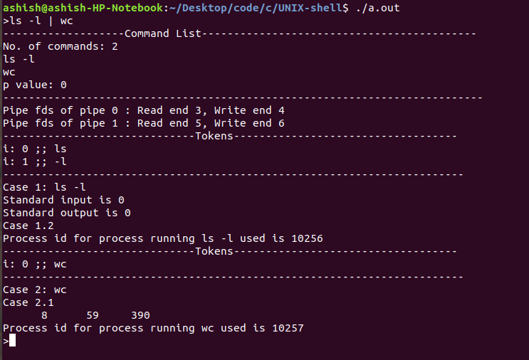
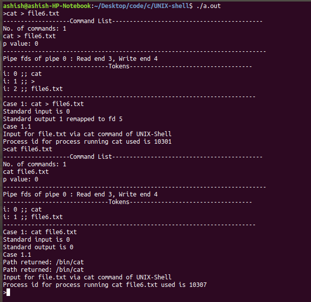
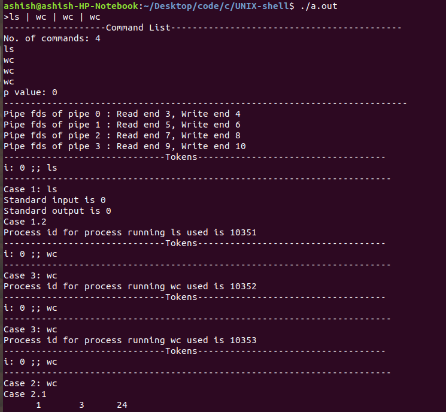
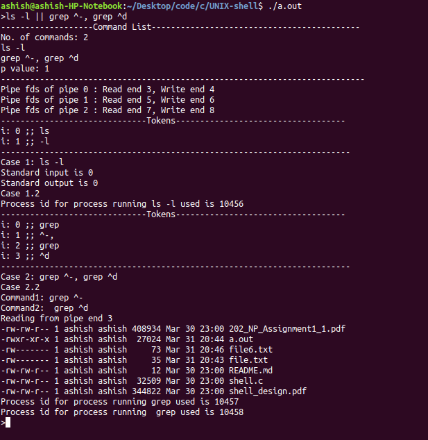
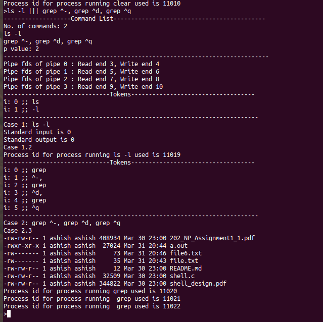
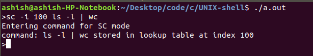
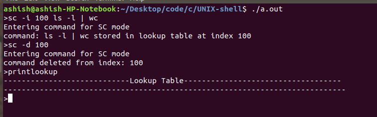
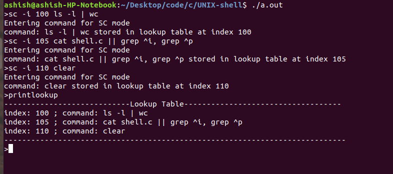
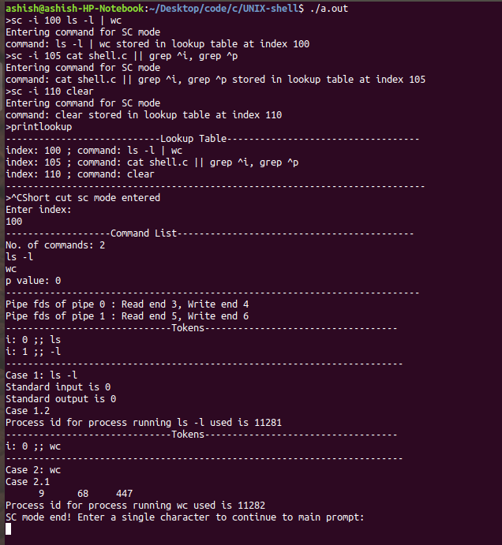

# UNIX Shell

This bash like shell was built for the partial fulfillment of the course IS F462 - Networking Programming

## Objectives

### UNIX commands
* Shell waits for the user to enter a command. User can enter a command with multiple arguments 
* 

### Redirection operators
* Shell supports >, < and >> redirection operators. 
* 

### Single pipelined commands
* Shell supports any number of commands in the pipeline.
* 

### Double pipeline operator ' || '
* Shell supports "||" (double pipe operator). Ex -: ls -l || grep ^-, grep ^d. It means that output of ls -l command is passed as input to two other commands. 
* 

### Triple pipeline operator ' ||| '
* Shell supports "|||" (triple pipe operator). Ex -: ls -l || grep ^-, grep ^d, grep ^q. It means that output of ls -l command is passed as input to three other commands. 
* 

### Short cut commands mode
* Shell supports sc mode executed by command sc.  In this mode, a command can be executed by pressing Ctrl-C and pressing a number. This number corresponds to the index in the look up table created and deleted by the commands **sc -i <index> <cmd>** / **sc -d <index>**.
  * Inserting a command at particular index in the lookup table.
  * 
  * Deleting a command from a particular index. 
  * 
  * Printing the lookup table. 
  * 
  * Executing a command from lookup table 
  * 
